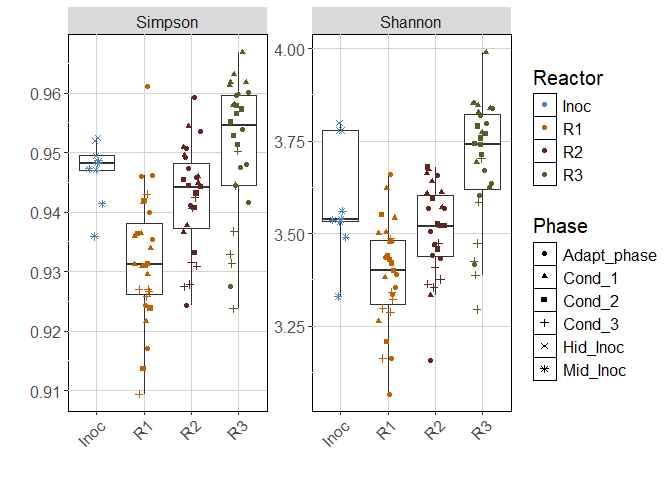
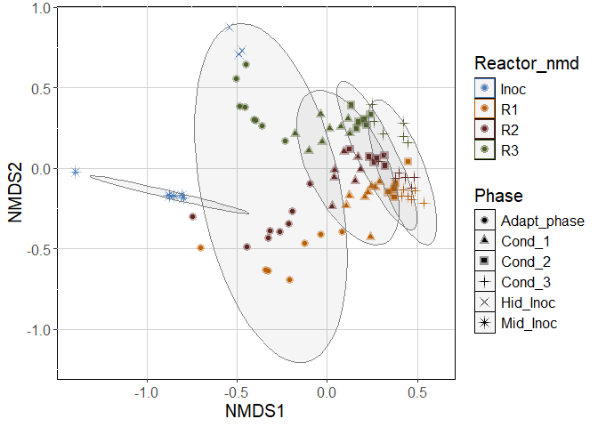
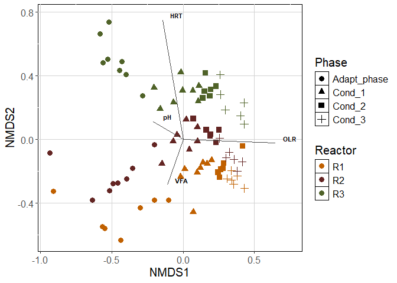

Phyloseq_16S
================
2026-04

# Loading libraries. If needed, use BiocManager to install them

``` r
library("phyloseq");packageVersion("phyloseq")
```

    ## [1] '1.48.0'

``` r
library("ggplot2");packageVersion("ggplot2")
```

    ## Warning: package 'ggplot2' was built under R version 4.4.3

    ## [1] '4.0.0'

``` r
library("vegan");packageVersion("vegan")
```

    ## Warning: package 'vegan' was built under R version 4.4.3

    ## Loading required package: permute

    ## Warning: package 'permute' was built under R version 4.4.3

    ## [1] '2.7.1'

``` r
library("readr");packageVersion("readr")
```

    ## Warning: package 'readr' was built under R version 4.4.3

    ## [1] '2.2.0'

``` r
library("tidyverse");packageVersion("tidyverse")
```

    ## Warning: package 'tidyverse' was built under R version 4.4.3

    ## Warning: package 'tibble' was built under R version 4.4.3

    ## Warning: package 'tidyr' was built under R version 4.4.3

    ## Warning: package 'purrr' was built under R version 4.4.3

    ## Warning: package 'stringr' was built under R version 4.4.3

    ## Warning: package 'forcats' was built under R version 4.4.3

    ## Warning: package 'lubridate' was built under R version 4.4.3

    ## ── Attaching core tidyverse packages ──────────────────────── tidyverse 2.0.0 ──
    ## ✔ dplyr     1.1.4     ✔ stringr   1.6.0
    ## ✔ forcats   1.0.1     ✔ tibble    3.3.0
    ## ✔ lubridate 1.9.5     ✔ tidyr     1.3.2
    ## ✔ purrr     1.2.2

    ## ── Conflicts ────────────────────────────────────────── tidyverse_conflicts() ──
    ## ✖ dplyr::filter() masks stats::filter()
    ## ✖ dplyr::lag()    masks stats::lag()
    ## ℹ Use the conflicted package (<http://conflicted.r-lib.org/>) to force all conflicts to become errors

    ## [1] '2.0.0'

``` r
library("RColorBrewer");packageVersion("RColorBrewer")
```

    ## [1] '1.1.3'

# Importing files and renaming ASVs

``` r
seqtab.nochim <- readr::read_csv("seqtab.nochim.csv")
```

    ## New names:
    ## Rows: 95 Columns: 1587
    ## ── Column specification
    ## ──────────────────────────────────────────────────────── Delimiter: "," chr
    ## (1): ...1 dbl (1586):
    ## TGGGGAATATTGCACAATGGGGGAAACCCTGATGCAGCGACGCCGCGTGAGTGAAGAAGTATTT...
    ## ℹ Use `spec()` to retrieve the full column specification for this data. ℹ
    ## Specify the column types or set `show_col_types = FALSE` to quiet this message.
    ## • `` -> `...1`

``` r
seqtab.nochim <- as.data.frame(seqtab.nochim)
rownames(seqtab.nochim) <- seqtab.nochim[, 1]
seqtab.nochim <- seqtab.nochim[, -1]
colnames(seqtab.nochim) = paste0("ASV", 1:ncol(seqtab.nochim)) 

taxa <- read.csv("taxa.csv", row.names = 1)
row.names(taxa) = colnames(seqtab.nochim)
taxa <- as.matrix(taxa)

metadata <- read.csv("metadata.csv", stringsAsFactors = TRUE, row.names = 1)
```

# Building phyloseq object and removing Archaea sequences

``` r
ps.silva.nochim <- phyloseq(
  otu_table(seqtab.nochim, taxa_are_rows=FALSE),
  sample_data(metadata),
  tax_table(taxa))

ps <- subset_taxa(ps.silva.nochim, Kingdom !="Archaea")

ps
```

    ## phyloseq-class experiment-level object
    ## otu_table()   OTU Table:         [ 1540 taxa and 95 samples ]
    ## sample_data() Sample Data:       [ 95 samples by 14 sample variables ]
    ## tax_table()   Taxonomy Table:    [ 1540 taxa by 6 taxonomic ranks ]

# Raryfing

``` r
set.seed(1)

counts <- sample_sums(ps)
sort(counts)
```

    ##     B6    B66    B82    B17    B41     B2    B55    B33    B84    B74    B27 
    ##   9421  41738  43587  44399  50205  53450  53912  54110  55171  56634  57003 
    ##    B49    B81    B73     B3    B51     B4    B57    B32    B94    B76    B89 
    ##  57111  58011  60928  61144  61239  61952  62830  63038  63613  65152  65424 
    ##    B25     B7    B23    B52    B60    B39    B91    B86    B96    B34    B31 
    ##  65602  65640  65769  66788  67366  68178  68201  68421  68571  68746  69663 
    ##    B80    B22     B5    B37    B19    B24    B90    B67    B88    B13    B64 
    ##  69715  70370  70742  71115  71131  71397  71603  71954  72578  72833  73515 
    ##    B83    B30    B46    B70    B68    B12    B56    B18    B92    B72    B58 
    ##  73621  74532  74726  74836  74983  75058  75137  75228  75248  75469  75614 
    ##    B26    B28    B79    B21    B54    B78    B43    B87     B1     B8    B16 
    ##  76166  76166  76743  77005  77358  78812  79514  79718  80542  80545  80590 
    ##     B9    B11    B15    B40    B29    B48    B75    B44    B62    B71    B59 
    ##  81230  81917  83408  84582  86479  86644  87001  88582  89016  89705  90244 
    ##    B63    B50    B10    B95    B47    B35    B14    B65    B61    B53    B77 
    ##  91380  92103  92465  92898  93019  95488  97525 116267 190642 213585 231713 
    ##    B20    B69    B36    B45    B42    B85    B93 
    ## 241848 242499 262378 268073 393335 415909 429720

``` r
ps_withoutB6 <- subset_samples(ps, Code != "B6")

ps_withoutB6_rarified <- rarefy_even_depth(ps_withoutB6, sample.size = min(sample_sums(ps_withoutB6)),
                  rngseed = FALSE, replace = FALSE, trimOTUs = TRUE, verbose = TRUE)
```

    ## You set `rngseed` to FALSE. Make sure you've set & recorded
    ##  the random seed of your session for reproducibility.
    ## See `?set.seed`

    ## ...

    ## 135OTUs were removed because they are no longer 
    ## present in any sample after random subsampling

    ## ...

# Samples colected from the foam will not be used in this manuscript, so we exclude them from the analysis

``` r
ps_withoutB6_rarified_withoutFOAM <- subset_samples(ps_withoutB6_rarified, Phase != "R1_Foam")
ps_withoutB6_rarified_withoutFOAM <- subset_samples(ps_withoutB6_rarified_withoutFOAM, Phase != "R2_Foam")
ps_withoutB6_rarified_withoutFOAM <- subset_samples(ps_withoutB6_rarified_withoutFOAM, Phase != "R3_Foam")
ps_withoutB6_rarified_withoutFOAM
```

    ## phyloseq-class experiment-level object
    ## otu_table()   OTU Table:         [ 1405 taxa and 91 samples ]
    ## sample_data() Sample Data:       [ 91 samples by 14 sample variables ]
    ## tax_table()   Taxonomy Table:    [ 1405 taxa by 6 taxonomic ranks ]

# Alpha-diversity figure

``` r
cols <- c("Inoc" = "#4F81BD", "R1" = "#C06000", "R2" = "#632523", "R3" = "#4F6228")
cols2 <- c("Mid_Inoc" = "#4F81BD", "Hid_Inoc" = "#4F81BD", "R1" = "#C06000", "R2" = "#632523", "R3" = "#4F6228")

adiv <- data.frame(
  "Shannon" = phyloseq::estimate_richness(ps_withoutB6_rarified_withoutFOAM, measures = "Shannon"),
  "Simpson" = phyloseq::estimate_richness(ps_withoutB6_rarified_withoutFOAM, measures = "Simpson"),
  "Phase" = phyloseq::sample_data(ps_withoutB6_rarified_withoutFOAM)$Phase,
  "Reactor" = phyloseq::sample_data(ps_withoutB6_rarified_withoutFOAM)$Reactor_nmd)
head(adiv)
```

    ##      Shannon   Simpson       Phase Reactor
    ## B1  3.388533 0.9354489 Adapt_phase      R1
    ## B10 3.381991 0.9364376      Cond_1      R1
    ## B11 3.478463 0.9295877      Cond_1      R1
    ## B12 3.476602 0.9215999      Cond_1      R1
    ## B13 3.500004 0.9311817      Cond_1      R1
    ## B14 3.503752 0.9308958      Cond_1      R1

``` r
#png("figures_article/alpha_treatment.png", width = 7, height = 4, units = "in", res=300)
adiv %>%
  gather(key = metric, value = value, c("Simpson", "Shannon")) %>%
  mutate(metric = factor(metric, levels = c("Simpson", "Shannon"))) %>%
  ggplot(aes(x = Reactor, y = value)) +
  geom_boxplot(outlier.color = NA) +
  scale_colour_manual(values = cols) +
  scale_shape_manual(values= c(16, 17, 15, 3, 4, 8)) +
  geom_jitter(aes(color = Reactor, shape = Phase), height = 0, width = .2) +
  labs(x = "", y = "") +
  facet_wrap(~ metric, scales = "free") +
  theme(panel.background = element_rect(fill='white', colour='black'), 
        panel.grid.major = element_line(colour = "lightgrey"), text = element_text(size = 15), 
        axis.text.x = element_text(angle = 45, hjust = 1) )
```

<!-- -->

``` r
#dev.off()
```

# Beta-diversity

``` r
NMDS.bray <- ordinate(ps_withoutB6_rarified_withoutFOAM, "NMDS", "bray")
```

    ## Square root transformation
    ## Wisconsin double standardization
    ## Run 0 stress 0.1034322 
    ## Run 1 stress 0.1034322 
    ## ... Procrustes: rmse 2.093295e-06  max resid 1.799667e-05 
    ## ... Similar to previous best
    ## Run 2 stress 0.1034343 
    ## ... Procrustes: rmse 0.0003318755  max resid 0.002248218 
    ## ... Similar to previous best
    ## Run 3 stress 0.1034322 
    ## ... Procrustes: rmse 3.667904e-06  max resid 3.211879e-05 
    ## ... Similar to previous best
    ## Run 4 stress 0.1034322 
    ## ... Procrustes: rmse 1.039436e-05  max resid 9.235529e-05 
    ## ... Similar to previous best
    ## Run 5 stress 0.1034322 
    ## ... Procrustes: rmse 6.246935e-06  max resid 3.560315e-05 
    ## ... Similar to previous best
    ## Run 6 stress 0.1034322 
    ## ... Procrustes: rmse 1.676997e-05  max resid 0.0001513671 
    ## ... Similar to previous best
    ## Run 7 stress 0.1034322 
    ## ... Procrustes: rmse 1.586711e-05  max resid 0.0001431728 
    ## ... Similar to previous best
    ## Run 8 stress 0.1034343 
    ## ... Procrustes: rmse 0.0003302463  max resid 0.002248118 
    ## ... Similar to previous best
    ## Run 9 stress 0.1034335 
    ## ... Procrustes: rmse 0.0002093269  max resid 0.001502012 
    ## ... Similar to previous best
    ## Run 10 stress 0.1034343 
    ## ... Procrustes: rmse 0.0003301398  max resid 0.002245248 
    ## ... Similar to previous best
    ## Run 11 stress 0.1034343 
    ## ... Procrustes: rmse 0.0003312759  max resid 0.002238906 
    ## ... Similar to previous best
    ## Run 12 stress 0.1034322 
    ## ... Procrustes: rmse 9.327114e-06  max resid 8.125233e-05 
    ## ... Similar to previous best
    ## Run 13 stress 0.1034322 
    ## ... Procrustes: rmse 7.87542e-06  max resid 7.011579e-05 
    ## ... Similar to previous best
    ## Run 14 stress 0.1034323 
    ## ... Procrustes: rmse 2.225322e-05  max resid 0.0002005411 
    ## ... Similar to previous best
    ## Run 15 stress 0.1034335 
    ## ... Procrustes: rmse 0.0002091002  max resid 0.001493993 
    ## ... Similar to previous best
    ## Run 16 stress 0.1034343 
    ## ... Procrustes: rmse 0.0003310166  max resid 0.002237582 
    ## ... Similar to previous best
    ## Run 17 stress 0.1034322 
    ## ... Procrustes: rmse 1.037584e-05  max resid 9.35154e-05 
    ## ... Similar to previous best
    ## Run 18 stress 0.1034322 
    ## ... Procrustes: rmse 8.321677e-06  max resid 7.516008e-05 
    ## ... Similar to previous best
    ## Run 19 stress 0.1034343 
    ## ... Procrustes: rmse 0.0003307169  max resid 0.002241677 
    ## ... Similar to previous best
    ## Run 20 stress 0.1034343 
    ## ... Procrustes: rmse 0.0003303053  max resid 0.002248208 
    ## ... Similar to previous best
    ## *** Best solution repeated 20 times

``` r
NMDS.bray
```

    ## 
    ## Call:
    ## metaMDS(comm = veganifyOTU(physeq), distance = distance) 
    ## 
    ## global Multidimensional Scaling using monoMDS
    ## 
    ## Data:     wisconsin(sqrt(veganifyOTU(physeq))) 
    ## Distance: bray 
    ## 
    ## Dimensions: 2 
    ## Stress:     0.1034322 
    ## Stress type 1, weak ties
    ## Best solution was repeated 20 times in 20 tries
    ## The best solution was from try 0 (metric scaling or null solution)
    ## Scaling: centring, PC rotation, halfchange scaling 
    ## Species: expanded scores based on 'wisconsin(sqrt(veganifyOTU(physeq)))'

``` r
plot_NMDS <- plot_ordination(ps_withoutB6_rarified_withoutFOAM, NMDS.bray, type="samples", color="Reactor_nmd", shape = "Phase")
```

    ## Warning: `aes_string()` was deprecated in ggplot2 3.0.0.
    ## ℹ Please use tidy evaluation idioms with `aes()`.
    ## ℹ See also `vignette("ggplot2-in-packages")` for more information.
    ## ℹ The deprecated feature was likely used in the phyloseq package.
    ##   Please report the issue at <https://github.com/joey711/phyloseq/issues>.
    ## This warning is displayed once per session.
    ## Call `lifecycle::last_lifecycle_warnings()` to see where this warning was
    ## generated.

``` r
# plot with all samples 
#png("figures_article/NMDS_bray_elipse.png", width = 7, height = 4, units = "in", res=300)
plot_NMDS + 
  scale_colour_manual(values = cols) + 
  geom_point(alpha = 0.4, size = 3) + # Reduce alpha for better visibility of overlays
  scale_shape_manual(values= c(16, 17, 15, 3, 4, 8)) +
  stat_ellipse(geom = "polygon", alpha = 0.05, level = 0.95, aes(color = Phase), show.legend = TRUE, linetype = 1) +  # Add ellipses
  theme(panel.background = element_rect(fill='white', colour='black'), panel.grid.major = element_line(colour = "lightgrey"), text = element_text(size = 15))
```

    ## Too few points to calculate an ellipse

<!-- -->

``` r
#dev.off()


# plot without inoculum samples and environmental variables
# following this script: https://jkzorz.github.io/2020/04/04/NMDS-extras.html
ps_withoutB6_rarified_withoutFOAM_withoutINOC = subset_samples(ps_withoutB6_rarified_withoutFOAM, Reactor_nmd != "Inoc")

NMDS.bray2 <- ordinate(ps_withoutB6_rarified_withoutFOAM_withoutINOC, "NMDS", "bray")
```

    ## Square root transformation
    ## Wisconsin double standardization
    ## Run 0 stress 0.1144744 
    ## Run 1 stress 0.114477 
    ## ... Procrustes: rmse 0.0007176913  max resid 0.004646947 
    ## ... Similar to previous best
    ## Run 2 stress 0.1144744 
    ## ... New best solution
    ## ... Procrustes: rmse 6.822321e-06  max resid 4.037524e-05 
    ## ... Similar to previous best
    ## Run 3 stress 0.114477 
    ## ... Procrustes: rmse 0.0007177321  max resid 0.004647428 
    ## ... Similar to previous best
    ## Run 4 stress 0.114477 
    ## ... Procrustes: rmse 0.0007173584  max resid 0.004650841 
    ## ... Similar to previous best
    ## Run 5 stress 0.114477 
    ## ... Procrustes: rmse 0.0007176791  max resid 0.004653589 
    ## ... Similar to previous best
    ## Run 6 stress 0.114477 
    ## ... Procrustes: rmse 0.0007177302  max resid 0.004647188 
    ## ... Similar to previous best
    ## Run 7 stress 0.1972303 
    ## Run 8 stress 0.114477 
    ## ... Procrustes: rmse 0.0007177744  max resid 0.004646244 
    ## ... Similar to previous best
    ## Run 9 stress 0.1144744 
    ## ... Procrustes: rmse 2.844118e-06  max resid 1.658408e-05 
    ## ... Similar to previous best
    ## Run 10 stress 0.114477 
    ## ... Procrustes: rmse 0.0007173023  max resid 0.00465145 
    ## ... Similar to previous best
    ## Run 11 stress 0.1144744 
    ## ... New best solution
    ## ... Procrustes: rmse 4.133308e-06  max resid 1.799006e-05 
    ## ... Similar to previous best
    ## Run 12 stress 0.114477 
    ## ... Procrustes: rmse 0.0007176774  max resid 0.004647287 
    ## ... Similar to previous best
    ## Run 13 stress 0.1144744 
    ## ... Procrustes: rmse 6.566605e-06  max resid 4.236541e-05 
    ## ... Similar to previous best
    ## Run 14 stress 0.114477 
    ## ... Procrustes: rmse 0.0007172606  max resid 0.004648581 
    ## ... Similar to previous best
    ## Run 15 stress 0.1144744 
    ## ... Procrustes: rmse 9.812325e-06  max resid 6.434454e-05 
    ## ... Similar to previous best
    ## Run 16 stress 0.114477 
    ## ... Procrustes: rmse 0.0007176847  max resid 0.004650109 
    ## ... Similar to previous best
    ## Run 17 stress 0.1144744 
    ## ... New best solution
    ## ... Procrustes: rmse 2.615929e-06  max resid 1.47001e-05 
    ## ... Similar to previous best
    ## Run 18 stress 0.114477 
    ## ... Procrustes: rmse 0.0007172722  max resid 0.004651677 
    ## ... Similar to previous best
    ## Run 19 stress 0.1144744 
    ## ... Procrustes: rmse 7.732107e-06  max resid 5.083311e-05 
    ## ... Similar to previous best
    ## Run 20 stress 0.2070203 
    ## *** Best solution repeated 3 times

``` r
NMDS.bray2
```

    ## 
    ## Call:
    ## metaMDS(comm = veganifyOTU(physeq), distance = distance) 
    ## 
    ## global Multidimensional Scaling using monoMDS
    ## 
    ## Data:     wisconsin(sqrt(veganifyOTU(physeq))) 
    ## Distance: bray 
    ## 
    ## Dimensions: 2 
    ## Stress:     0.1144744 
    ## Stress type 1, weak ties
    ## Best solution was repeated 3 times in 20 tries
    ## The best solution was from try 17 (random start)
    ## Scaling: centring, PC rotation, halfchange scaling 
    ## Species: expanded scores based on 'wisconsin(sqrt(veganifyOTU(physeq)))'

``` r
metadata_new <- read.csv2("metadata_new_mod.csv", stringsAsFactors = TRUE, row.names = 1)

en <- envfit(NMDS.bray2, metadata_new, permutations = 999, na.rm = TRUE)

data.scores <- as.data.frame(scores(NMDS.bray2)$sites)
data.scores$Phase <- ps_withoutB6_rarified_withoutFOAM_withoutINOC@sam_data$Phase
data.scores$Reactor <- ps_withoutB6_rarified_withoutFOAM_withoutINOC@sam_data$Reactor_nmd

en_coord_cont = as.data.frame(scores(en, "vectors")) * ordiArrowMul(en)

#png("figures_article/NMDS_bray_with_env.png", width = 7, height = 4, units = "in", res=300)
ggplot(data = data.scores, aes(x = NMDS1, y = NMDS2)) + 
  geom_point(data = data.scores, aes(colour = Reactor, shape = Phase), size = 3) + 
  scale_colour_manual(values = cols) + 
  scale_shape_manual(values= c(16, 17, 15, 3, 4, 8)) +
  geom_segment(aes(x = 0, y = 0, xend = NMDS1, yend = NMDS2), 
               data = en_coord_cont, size =0.5, alpha = 1, colour = "grey30") +
  geom_text(data = en_coord_cont, aes(x = NMDS1+0.1, y = NMDS2+0.03), colour = "black", 
            fontface = "bold", label = row.names(en_coord_cont), size =3) +
  labs(shape="Phase", colour="Reactor") +
  theme(panel.background = element_rect(fill='white', colour='black'), panel.grid.major = element_line(colour = "lightgrey"), text = element_text(size = 15))
```

    ## Warning: Using `size` aesthetic for lines was deprecated in ggplot2 3.4.0.
    ## ℹ Please use `linewidth` instead.
    ## This warning is displayed once per session.
    ## Call `lifecycle::last_lifecycle_warnings()` to see where this warning was
    ## generated.

<!-- -->

``` r
#dev.off()
```

# Taxonomy plot - Family

``` r
list_days <- c("R1-1", "R1-2", "R1-3", "R2-1", "R2-2", "R2-3", "R3-1", "R3-2", "R3-3", "2", "6", "10", "14", "18", "22", "28", "40", "52", "54", "64", "76", "78", "88", "90", "100", "102", "112", "114", "124", "126", "136", "138", "144", "146", "152", "154", "160", "162", "168", "170", "176", "178", "180", "182", "184", "186", "192", "194", "200", "202", "208", "210", "216", "218", "224", "226")

y1p <- tax_glom(ps_withoutB6_rarified_withoutFOAM_withoutINOC, taxrank = 'Family') # agglomerate taxa
y3p <- transform_sample_counts(y1p, function(x) x/sum(x)) #get abundance in %
y4p <- psmelt(y3p) # create dataframe from phyloseq object
y4p$Family <- as.character(y4p$Family) #convert to character
y4p$Family[y4p$Abundance < 0.05] <- " Family < 5% abund." #rename genera with < 1% abundance

#set color palette to accommodate the number of genera
colourCount <- length(unique(y4p$Family))
getPalette <- colorRampPalette(brewer.pal(9, "Set1"))

#plot
y4p$Days_operation = factor(y4p$Days_operation, levels= list_days)

# all samples
#png("figures_article/Tax_Family_days.png", width = 10, height = 4, units = "in", res=300)
p_p <- ggplot(data=y4p, aes(x=Days_operation, y=Abundance, fill=Family))
p_p + geom_bar(aes(), stat="identity", position="stack") + 
  facet_wrap(~ Reactor_tax, 
             #nrow = 3, 
             scales = "free", labeller = labeller(.multi_line = FALSE)) +
  scale_fill_manual(values=getPalette(colourCount)) + 
  xlab("Days of operation") + ylab("Relative Abundance") +
# guides(fill=guide_legend(nrow=5)) +
  theme(axis.text.x = element_text(angle=90, size= 8), axis.title.x = element_text(vjust=0), 
        text = element_text(size = 12), legend.position = "bottom")
```

<!-- -->

``` r
#dev.off()
```

# Taxonomy plot - Genus

``` r
y1p <- tax_glom(ps_withoutB6_rarified_withoutFOAM_withoutINOC, taxrank = 'Genus') # agglomerate taxa
y3p <- transform_sample_counts(y1p, function(x) x/sum(x)) #get abundance in %
y4p <- psmelt(y3p) # create dataframe from phyloseq object
y4p$Genus <- as.character(y4p$Genus) #convert to character
y4p$Genus[y4p$Abundance < 0.05] <- " Genus < 5% abund." #rename genera with < 1% abundance

#set color palette to accommodate the number of genera
colourCount = length(unique(y4p$Genus))

#plot
y4p$Days_operation = factor(y4p$Days_operation, levels= list_days)

# all samples
#png("figures_article/Tax_Genus_days.png", width = 10, height = 4, units = "in", res=300)
p_p <- ggplot(data=y4p, aes(x=Days_operation, y=Abundance, fill=Genus))
p_p + geom_bar(aes(), stat="identity", position="stack") + 
  facet_wrap(~ Reactor_tax, 
             #nrow = 3, 
             scales = "free", labeller = labeller(.multi_line = FALSE)) +
  scale_fill_manual(values=getPalette(colourCount)) + 
  xlab("Days of operation") + ylab("Relative Abundance") +
  #  guides(fill=guide_legend(nrow=5)) +
  theme(axis.text.x = element_text(angle=90, size= 8), axis.title.x = element_text(vjust=0),
        text = element_text(size = 10), legend.position = "bottom")
```

<!-- -->

``` r
#dev.off()
```
