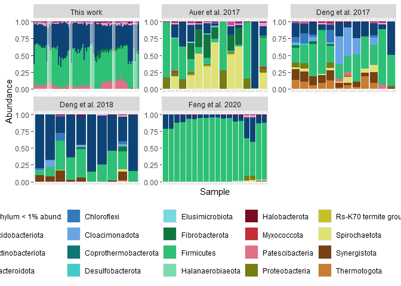
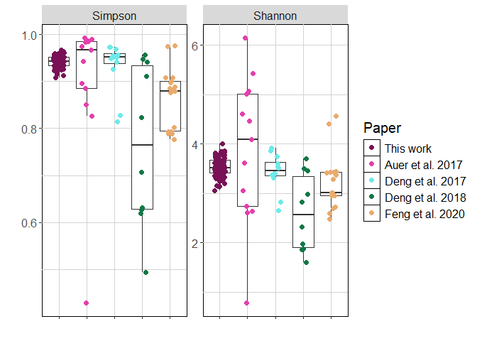
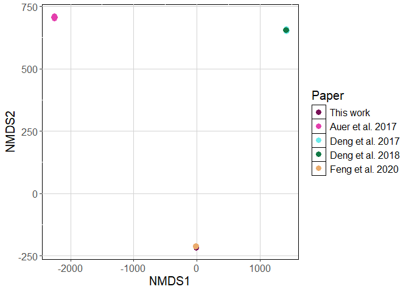

Paper_comparison
================
2026-04

# Loading libraries. If needed, use BiocManager to install them

    ## Package: phyloseq
    ## Version: 1.48.0
    ## 
    ## -- File: C:/Users/maria/AppData/Local/R/win-library/4.4/phyloseq/Meta/package.rds 
    ## -- Fields read: Package, Version

    ## Package: ggplot2
    ## Version: 4.0.0
    ## 
    ## -- File: C:/Users/maria/AppData/Local/R/win-library/4.4/ggplot2/Meta/package.rds 
    ## -- Fields read: Package, Version

    ## Package: vegan
    ## Version: 2.7-1
    ## 
    ## -- File: C:/Users/maria/AppData/Local/R/win-library/4.4/vegan/Meta/package.rds 
    ## -- Fields read: Package, Version

    ## Package: readr
    ## Version: 2.2.0
    ## 
    ## -- File: C:/Users/maria/AppData/Local/R/win-library/4.4/readr/Meta/package.rds 
    ## -- Fields read: Package, Version

    ## Package: tidyverse
    ## Version: 2.0.0
    ## 
    ## -- File: C:/Users/maria/AppData/Local/R/win-library/4.4/tidyverse/Meta/package.rds 
    ## -- Fields read: Package, Version

    ## Package: RColorBrewer
    ## Version: 1.1-3
    ## 
    ## -- File: C:/Users/maria/AppData/Local/R/win-library/4.4/RColorBrewer/Meta/package.rds 
    ## -- Fields read: Package, Version

# Importing files, renaming ASVs and creating phyloseq object - AUER

``` r
seqtab.nochim_auer <- readr::read_csv("Auer_seqtab.nochim_16S.csv")
```

    ## New names:
    ## Rows: 16 Columns: 4546
    ## ── Column specification
    ## ──────────────────────────────────────────────────────── Delimiter: "," chr
    ## (1): ...1 dbl (4545):
    ## TGGGGAATATTGCACAATGGGGGAAACCCTGATGCAGCGACGCCGCGTGAGTGAAGAAGTATTT...
    ## ℹ Use `spec()` to retrieve the full column specification for this data. ℹ
    ## Specify the column types or set `show_col_types = FALSE` to quiet this message.
    ## • `` -> `...1`

``` r
seqtab.nochim_auer <- as.data.frame(seqtab.nochim_auer)
rownames(seqtab.nochim_auer) <- seqtab.nochim_auer[, 1]
seqtab.nochim_auer <- seqtab.nochim_auer[, -1]

taxa_auer <- read.csv("Auer_taxa_16S.csv", row.names = 1)
taxa_auer <- as.matrix(taxa_auer)

metadata_auer <- read.csv("Metadata_AUER.csv", stringsAsFactors = TRUE, row.names = 1)

ps_auer <- phyloseq(
  otu_table(seqtab.nochim_auer, taxa_are_rows=FALSE),
  sample_data(metadata_auer),
  tax_table(taxa_auer))

ps_auer
```

    ## phyloseq-class experiment-level object
    ## otu_table()   OTU Table:         [ 4545 taxa and 16 samples ]
    ## sample_data() Sample Data:       [ 16 samples by 8 sample variables ]
    ## tax_table()   Taxonomy Table:    [ 4545 taxa by 6 taxonomic ranks ]

# Importing files, renaming ASVs and creating phyloseq object - DENG_2017

``` r
seqtab.nochim_DENG7 <- readr::read_csv("Deng_seqtab.nochim_16S.csv")
```

    ## New names:
    ## Rows: 12 Columns: 409
    ## ── Column specification
    ## ──────────────────────────────────────────────────────── Delimiter: "," chr
    ## (1): ...1 dbl (408):
    ## TCGAGAATAGTCTACAATGGACGGAAGTCTGATAGTGCGACGCCGCGTGAACGAAGAATCCCTTC...
    ## ℹ Use `spec()` to retrieve the full column specification for this data. ℹ
    ## Specify the column types or set `show_col_types = FALSE` to quiet this message.
    ## • `` -> `...1`

``` r
seqtab.nochim_DENG7 <- as.data.frame(seqtab.nochim_DENG7)
rownames(seqtab.nochim_DENG7) <- seqtab.nochim_DENG7[, 1]
seqtab.nochim_DENG7 <- seqtab.nochim_DENG7[, -1]

taxa_DENG7 <- read.csv("Deng_taxa_16S.csv", row.names = 1)
taxa_DENG7 <- as.matrix(taxa_DENG7)

metadata_DENG7 <- read.csv("Metadata_DENG_2017.csv", stringsAsFactors = TRUE, row.names = 1)

ps_DENG7 <- phyloseq(
  otu_table(seqtab.nochim_DENG7, taxa_are_rows=FALSE),
  sample_data(metadata_DENG7),
  tax_table(taxa_DENG7))

ps_DENG7
```

    ## phyloseq-class experiment-level object
    ## otu_table()   OTU Table:         [ 408 taxa and 12 samples ]
    ## sample_data() Sample Data:       [ 12 samples by 6 sample variables ]
    ## tax_table()   Taxonomy Table:    [ 408 taxa by 6 taxonomic ranks ]

# Importing files, renaming ASVs and creating phyloseq object - DENG_2018

``` r
seqtab.nochim_DENG8 <- readr::read_csv("Deng_2_seqtab.nochim_16S.csv")
```

    ## New names:
    ## Rows: 10 Columns: 304
    ## ── Column specification
    ## ──────────────────────────────────────────────────────── Delimiter: "," chr
    ## (1): ...1 dbl (303):
    ## TGAGGAATATTGGACAATGGCCGGAAGGCTGATCCAGCCATGCCGCGTGCGGGAGGACGGCCCTA...
    ## ℹ Use `spec()` to retrieve the full column specification for this data. ℹ
    ## Specify the column types or set `show_col_types = FALSE` to quiet this message.
    ## • `` -> `...1`

``` r
seqtab.nochim_DENG8 <- as.data.frame(seqtab.nochim_DENG8)
rownames(seqtab.nochim_DENG8) <- seqtab.nochim_DENG8[, 1]
seqtab.nochim_DENG8 <- seqtab.nochim_DENG8[, -1]

taxa_DENG8 <- read.csv("Deng_2_taxa_16S.csv", row.names = 1)
taxa_DENG8 <- as.matrix(taxa_DENG8)

metadata_DENG8 <- read.csv("Metadata_DENG_2018.csv", stringsAsFactors = TRUE, row.names = 1)

ps_DENG8 <- phyloseq(
  otu_table(seqtab.nochim_DENG8, taxa_are_rows=FALSE),
  sample_data(metadata_DENG8),
  tax_table(taxa_DENG8))

ps_DENG8
```

    ## phyloseq-class experiment-level object
    ## otu_table()   OTU Table:         [ 303 taxa and 10 samples ]
    ## sample_data() Sample Data:       [ 10 samples by 5 sample variables ]
    ## tax_table()   Taxonomy Table:    [ 303 taxa by 6 taxonomic ranks ]

# Importing files, renaming ASVs and creating phyloseq object - FENG

``` r
seqtab.nochim_FENG <- readr::read_csv("Feng_seqtab.nochim_16S.csv")
```

    ## New names:
    ## Rows: 18 Columns: 954
    ## ── Column specification
    ## ──────────────────────────────────────────────────────── Delimiter: "," chr
    ## (1): ...1 dbl (953):
    ## TGGGGAATATTGCGCAATGGGGGGAACCCTGACGCAGCGACGCCGCGTGAAGGAAGAAGGCCTTC...
    ## ℹ Use `spec()` to retrieve the full column specification for this data. ℹ
    ## Specify the column types or set `show_col_types = FALSE` to quiet this message.
    ## • `` -> `...1`

``` r
seqtab.nochim_FENG <- as.data.frame(seqtab.nochim_FENG)
rownames(seqtab.nochim_FENG) <- seqtab.nochim_FENG[, 1]
seqtab.nochim_FENG <- seqtab.nochim_FENG[, -1]

taxa_FENG <- read.csv("Feng_taxa_16S.csv", row.names = 1)
taxa_FENG <- as.matrix(taxa_FENG)

metadata_FENG <- read.csv("Metadata_FENG.csv", stringsAsFactors = TRUE, row.names = 1)

ps_FENG <- phyloseq(
  otu_table(seqtab.nochim_FENG, taxa_are_rows=FALSE),
  sample_data(metadata_FENG),
  tax_table(taxa_FENG))

ps_FENG
```

    ## phyloseq-class experiment-level object
    ## otu_table()   OTU Table:         [ 953 taxa and 18 samples ]
    ## sample_data() Sample Data:       [ 18 samples by 5 sample variables ]
    ## tax_table()   Taxonomy Table:    [ 953 taxa by 6 taxonomic ranks ]

# Importing files, renaming ASVs and creating phyloseq object - Current work

``` r
seqtab.nochim <- readr::read_csv("seqtab.nochim.csv")
```

    ## New names:
    ## Rows: 95 Columns: 1587
    ## ── Column specification
    ## ──────────────────────────────────────────────────────── Delimiter: "," chr
    ## (1): ...1 dbl (1586):
    ## TGGGGAATATTGCACAATGGGGGAAACCCTGATGCAGCGACGCCGCGTGAGTGAAGAAGTATTT...
    ## ℹ Use `spec()` to retrieve the full column specification for this data. ℹ
    ## Specify the column types or set `show_col_types = FALSE` to quiet this message.
    ## • `` -> `...1`

``` r
seqtab.nochim <- as.data.frame(seqtab.nochim)
rownames(seqtab.nochim) <- seqtab.nochim[, 1]
seqtab.nochim <- seqtab.nochim[, -1]

taxa <- read.csv("taxa.csv", row.names = 1)
taxa <- as.matrix(taxa)

metadata <- read.csv("metadata.csv", stringsAsFactors = TRUE, row.names = 1)

ps <- phyloseq(
  otu_table(seqtab.nochim, taxa_are_rows=FALSE),
  sample_data(metadata),
  tax_table(taxa))

# excluding foam samples that were not used in this work
ps_Without_FOAM <- subset_samples(ps, Phase != "R1_Foam")
ps_Without_FOAM <- subset_samples(ps_Without_FOAM, Phase != "R2_Foam")
ps_Without_FOAM <- subset_samples(ps_Without_FOAM, Phase != "R3_Foam")
ps_Without_FOAM
```

    ## phyloseq-class experiment-level object
    ## otu_table()   OTU Table:         [ 1586 taxa and 92 samples ]
    ## sample_data() Sample Data:       [ 92 samples by 14 sample variables ]
    ## tax_table()   Taxonomy Table:    [ 1586 taxa by 6 taxonomic ranks ]

# Joining phyloseq objects

``` r
ps_all <- merge_phyloseq(ps_Without_FOAM, ps_auer, ps_DENG7, ps_DENG8, ps_FENG)
ps_all
```

    ## phyloseq-class experiment-level object
    ## otu_table()   OTU Table:         [ 7680 taxa and 148 samples ]
    ## sample_data() Sample Data:       [ 148 samples by 24 sample variables ]
    ## tax_table()   Taxonomy Table:    [ 7680 taxa by 6 taxonomic ranks ]

# Rarefying

``` r
set.seed(1)

counts <- sample_sums(ps_all)
sort(counts)
```

    ## SRR6151783 SRR6151787 SRR6151791         B6 SRR6151782 SRR6151793 SRR6151789 
    ##        391       2867       8941       9421      11738      12193      13390 
    ## SRR5028698 ERR3445453 SRR6151785 SRR5028318 SRR5028641 SRR6151780 SRR5028701 
    ##      15660      16915      18557      18729      19987      20978      24219 
    ## SRR5028640 ERR3445450 ERR3445456 SRR5028307 SRR5028694 ERR3445459 ERR3445454 
    ##      24856      25202      25785      25969      26097      26147      26666 
    ## ERR3445444 SRR5028696 ERR3445462 ERR3445463 SRR6122451 ERR3445465 SRR5028645 
    ##      27102      27505      28236      28250      28286      29637      29839 
    ## ERR3445447 SRR6122513 SRR5028692 SRR5028658 ERR3445451 ERR3445457 ERR3445445 
    ##      31024      31971      33480      34013      35190      35325      35544 
    ## SRR6122514 SRR6122511 ERR3445469 SRR6151781 SRR5028661 ERR3445448 ERR3445468 
    ##      38037      38252      38857      40260      40338      40390      40728 
    ##        B66 SRR6122509 SRR6151792        B82        B17 SRR6151779 ERR3445460 
    ##      41839      41965      43589      43613      44403      48218      48355 
    ## SRR6151794 SRR6151788        B41 ERR3445466 SRR6122510         B2        B55 
    ##      49120      49892      50224      50722      52148      53501      53925 
    ##        B33 SRR6151786        B84 SRR6151790        B74        B27        B49 
    ##      54140      54141      55187      56048      56729      57028      57145 
    ## SRR6122507        B81 SRR6151784        B73         B3        B51         B4 
    ##      57655      58060      59722      61032      61150      61272      61952 
    ##        B32        B57        B76        B25         B7 SRR6122506        B23 
    ##      63046      63408      65244      65629      65640      65761      65791 
    ##        B89        B52        B60        B39        B91        B34        B86 
    ##      66136      66816      67461      68218      68727      68746      69202 
    ##        B31        B80        B22         B5        B37        B19        B24 
    ##      69711      69749      70397      70742      71139      71155      71412 
    ##        B67        B90        B13        B88        B83        B64        B30 
    ##      72099      72403      72833      73423      73682      73728      74551 
    ##        B46        B70        B12        B68        B56        B18        B72 
    ##      74734      74994      75072      75101      75160      75237      75603 
    ##        B92        B58 SRR6122508        B28        B26        B79        B21 
    ##      75836      75840      76102      76181      76194      76856      77026 
    ##        B54        B78        B43        B87         B8         B1        B16 
    ##      77377      78910      79545      80355      80545      80610      80610 
    ##         B9        B11        B15        B40 SRR6122515        B29        B48 
    ##      81230      81925      83416      84621      85526      86536      86658 
    ##        B75        B44        B62        B71        B59        B63        B50 
    ##      87107      88618      89237      89894      90450      91672      92145 
    ##        B10        B47        B35        B14        B65        B61        B53 
    ##      92546      93026      95549      97532     116686     191399     213724 
    ##        B77        B20        B69        B36        B45        B42        B85 
    ##     232114     241982     243451     262624     268189     393335     418839 
    ##        B93 
    ##     432096

``` r
ps_all_rar<- rarefy_even_depth(ps_all, sample.size = 11738,
                  rngseed = FALSE, replace = FALSE, trimOTUs = TRUE, verbose = TRUE)
```

    ## You set `rngseed` to FALSE. Make sure you've set & recorded
    ##  the random seed of your session for reproducibility.
    ## See `?set.seed`

    ## ...

    ## 4 samples removedbecause they contained fewer reads than `sample.size`.

    ## Up to first five removed samples are:

    ## B6SRR6151783SRR6151787SRR6151791

    ## ...

    ## 1330OTUs were removed because they are no longer 
    ## present in any sample after random subsampling

    ## ...

``` r
ps_all_rar
```

    ## phyloseq-class experiment-level object
    ## otu_table()   OTU Table:         [ 6350 taxa and 144 samples ]
    ## sample_data() Sample Data:       [ 144 samples by 24 sample variables ]
    ## tax_table()   Taxonomy Table:    [ 6350 taxa by 6 taxonomic ranks ]

# Permanova

``` r
dist <- phyloseq::distance(ps_all_rar, method="bray")
head(dist)
```

    ## [1] 0.7098313 0.7278071 0.7285739 0.7084682 0.7085534 0.6758392

``` r
metadata_dist <- data.frame(sample_data(ps_all_rar))
head(metadata_dist)
```

    ##     geo_loc_name_country_continent     Paper Sample_Name geo_loc_name_country
    ## B1                          Europe This work        <NA>              Germany
    ## B10                         Europe This work        <NA>              Germany
    ## B11                         Europe This work        <NA>              Germany
    ## B12                         Europe This work        <NA>              Germany
    ## B13                         Europe This work        <NA>              Germany
    ## B14                         Europe This work        <NA>              Germany
    ##     Sample.Name isolation_source Reactor_tax Reactor_div Reactor_nmd
    ## B1         <NA>             <NA>          R1          R1          R1
    ## B10        <NA>             <NA>          R1          R1          R1
    ## B11        <NA>             <NA>          R1          R1          R1
    ## B12        <NA>             <NA>          R1          R1          R1
    ## B13        <NA>             <NA>          R1          R1          R1
    ## B14        <NA>             <NA>          R1          R1          R1
    ##     Sampling_day Sampling_point Days_operation OLR HRT Sampling_interval Code
    ## B1      13.11.20             T1              2   5   8                 4   B1
    ## B10     14.01.21            T32             64   5   8                12  B10
    ## B11     26.01.21            T38             76   5   8                12  B11
    ## B12     07.02.21            T44             88   5   8                12  B12
    ## B13     19.02.21            T50            100   5   8                12  B13
    ## B14     03.03.21            T56            112   5   8                12  B14
    ##           Phase Library_Name Host Source Organism rel_to_oxygen Library.Name
    ## B1  Adapt_phase         <NA> <NA>   <NA>     <NA>          <NA>         <NA>
    ## B10      Cond_1         <NA> <NA>   <NA>     <NA>          <NA>         <NA>
    ## B11      Cond_1         <NA> <NA>   <NA>     <NA>          <NA>         <NA>
    ## B12      Cond_1         <NA> <NA>   <NA>     <NA>          <NA>         <NA>
    ## B13      Cond_1         <NA> <NA>   <NA>     <NA>          <NA>         <NA>
    ## B14      Cond_1         <NA> <NA>   <NA>     <NA>          <NA>         <NA>
    ##     geographic_location_.country_and.or_sea.
    ## B1                                      <NA>
    ## B10                                     <NA>
    ## B11                                     <NA>
    ## B12                                     <NA>
    ## B13                                     <NA>
    ## B14                                     <NA>

``` r
test.adonis_studies <- adonis2(dist ~ Paper, data = metadata_dist)
test.adonis_studies
```

    ## Permutation test for adonis under reduced model
    ## Permutation: free
    ## Number of permutations: 999
    ## 
    ## adonis2(formula = dist ~ Paper, data = metadata_dist)
    ##           Df SumOfSqs      R2      F Pr(>F)    
    ## Model      4   21.396 0.43295 26.532  0.001 ***
    ## Residual 139   28.024 0.56705                  
    ## Total    143   49.419 1.00000                  
    ## ---
    ## Signif. codes:  0 '***' 0.001 '**' 0.01 '*' 0.05 '.' 0.1 ' ' 1

# Plot taxonomy Phylum

``` r
custom_col28 = c("#771155", "#AA4488", "#EA6CC0", "#CC99BB", "#114477", "#4477AA","#1E78D2", "#77AADD", "#117777", "#44AAAA", "#3FE4E4", "#77CCCC", "#117744","#44AA77", "#1ED278", "#88CCAA", "#771122", "#AA4455", "#D21E2C","#DD7788","#777711", "#AAAA44", "#D2D21E", "#DDDD77","#774411", "#AA7744", "#D2781E", "#DDAA77")

y1p <- tax_glom(ps_all_rar, taxrank = 'Phylum') # agglomerate taxa
#(y2 = merge_samples(y1, "Partition")) # merge samples on sample variable of interest
y3p <- transform_sample_counts(y1p, function(x) x/sum(x)) #get abundance in %
y4p <- psmelt(y3p) # create dataframe from phyloseq object
y4p$Phylum <- as.character(y4p$Phylum) #convert to character
y4p$Phylum[y4p$Abundance < 0.01] <- " Phylum < 1% abund." #rename genera with < 1% abundance

#set color palette to accommodate the number of genera
colourCount = length(unique(y4p$Phylum))
getPalette = colorRampPalette(brewer.pal(9, "Set1"), interpolate="spline")
getPalette2 = colorRampPalette(custom_col28, interpolate="spline")

#png("figures_article/Tax_Phylum.png", width = 10, height = 6, units = "in", res=300)
p_p <- ggplot(data=y4p, aes(x=Sample, y=Abundance, fill=Phylum))
p_p + geom_bar(aes(), stat="identity", position="stack") + 
  facet_wrap(~ Paper , scales = "free", labeller = labeller(.multi_line = FALSE)) +
  scale_fill_manual(values=getPalette2(colourCount)) + 
  theme(axis.text.x=element_blank(), axis.ticks.x=element_blank(), legend.position="bottom") + 
  guides(fill=guide_legend(nrow=4))
```

<!-- -->

``` r
#dev.off()
```

# Taxonomy plot - Family

``` r
custom_col42 = c("#781156","#A51876","#D21E96","#E43FAD","#EA6CC0","#F098D3","#114578","#185EA5","#1E78D2","#3F91E4","#6CABEA","#98C4F0","#117878","#18A5A5","#3FE4E4","#6CEAEA","#98F0F0", "#117845","#18A55E","#1ED278","#3FE491","#6CEAAB","#98F0C4","#787811","#A5A518","#D2D21E","#E4E43F","#EAEA6C","#F0F098","#F7F7C5","#784511","#A55E18","#D2781E","#E4913F","#EAAB6C","#F0C498","#781122","#A5182F","#D21E2C","#E43F5B","#EA6C81","#F098A7")

y1p <- tax_glom(ps_all_rar, taxrank = 'Family') # agglomerate taxa
y3p <- transform_sample_counts(y1p, function(x) x/sum(x)) #get abundance in %
y4p <- psmelt(y3p) # create dataframe from phyloseq object
y4p$Family <- as.character(y4p$Family) #convert to character
y4p$Family[y4p$Abundance < 0.07] <- " Family < 7% abund." #rename genera with < 1% abundance

#set color palette to accommodate the number of genera
colourCount <- length(unique(y4p$Family))
getPalette = colorRampPalette(custom_col42, interpolate="spline")

# all samples
#png("figures_article/Tax_Family.png", width = 14, height = 9, units = "in", res=300)
p_p <- ggplot(data=y4p, aes(x=Sample, y=Abundance, fill=Family))
p_p + geom_bar(aes(), stat="identity", position="stack") + 
  facet_wrap(~ Paper , scales = "free", labeller = labeller(.multi_line = FALSE)) +
  scale_fill_manual(values=getPalette(colourCount)) + 
  xlab("Samples") + ylab("Relative Abundance") +
  theme(axis.text.x=element_blank(), axis.ticks.x=element_blank(), legend.position="bottom", text = element_text(size = 13)) +
  guides(fill=guide_legend(nrow=7))
```

<!-- -->

``` r
#dev.off()
```

# Alpha-diversity

``` r
cols <- c("This work" = "#781156", "Auer et al. 2017" = "#E43FAD", "Deng et al. 2017" = "#6CEAEA", "Deng et al. 2018" = "#117845", "Feng et al. 2020" = "#EAAB6C")


adiv <- data.frame(
  "Shannon" = phyloseq::estimate_richness(ps_all_rar, measures = "Shannon"),
  "Simpson" = phyloseq::estimate_richness(ps_all_rar, measures = "Simpson"),
  "Paper" = phyloseq::sample_data(ps_all_rar)$Paper)
head(adiv)
```

    ##      Shannon   Simpson     Paper
    ## B1  3.387729 0.9351371 This work
    ## B10 3.371801 0.9359529 This work
    ## B11 3.477654 0.9292887 This work
    ## B12 3.501781 0.9246412 This work
    ## B13 3.512916 0.9336169 This work
    ## B14 3.480801 0.9285849 This work

``` r
#png("figures_article/alpha.png", width = 7, height = 4, units = "in", res=300)
adiv %>%
  gather(key = metric, value = value, c("Simpson", "Shannon")) %>%
  mutate(metric = factor(metric, levels = c("Simpson", "Shannon"))) %>%
  ggplot(aes(x = Paper, y = value)) +
  geom_boxplot(outlier.color = NA) +
  scale_colour_manual(values = cols) +
  geom_jitter(aes(color = Paper), size = 2, height = 0, width = .2) +
  labs(x = "", y = "") +
  facet_wrap(~ metric, scales = "free") +
  theme(axis.text.x=element_blank(), panel.grid = element_line(colour = "lightgrey"), panel.background = element_rect(fill='white', colour='black'), text = element_text(size = 15))
```

<!-- -->

``` r
#dev.off()
```

# NMDS plot

``` r
NMDS.bray <- ordinate(ps_all_rar, "NMDS", "bray")
```

    ## Square root transformation
    ## Wisconsin double standardization
    ## Run 0 stress 0.0005466428 
    ## Run 1 stress 0.0003288823 
    ## ... New best solution
    ## ... Procrustes: rmse 0.05084418  max resid 0.1182952 
    ## Run 2 stress 0.0002098062 
    ## ... New best solution
    ## ... Procrustes: rmse 0.0318733  max resid 0.06439877 
    ## Run 3 stress 0.0007262862 
    ## Run 4 stress 0.001252233 
    ## Run 5 stress 0.0005692276 
    ## ... Procrustes: rmse 0.06420569  max resid 0.1362562 
    ## Run 6 stress 0.0004105181 
    ## ... Procrustes: rmse 0.02124768  max resid 0.05277402 
    ## Run 7 stress 0.0002228076 
    ## ... Procrustes: rmse 0.01887732  max resid 0.04788394 
    ## Run 8 stress 0.0004546663 
    ## ... Procrustes: rmse 0.05654263  max resid 0.1329966 
    ## Run 9 stress 0.000663676 
    ## ... Procrustes: rmse 0.03720672  max resid 0.09427107 
    ## Run 10 stress 0.001226316 
    ## Run 11 stress 0.0008659272 
    ## Run 12 stress 0.0003142431 
    ## ... Procrustes: rmse 0.02944147  max resid 0.05894713 
    ## Run 13 stress 0.0004625929 
    ## ... Procrustes: rmse 0.06897419  max resid 0.1913712 
    ## Run 14 stress 0.0003815173 
    ## ... Procrustes: rmse 0.06593663  max resid 0.208304 
    ## Run 15 stress 0.001151077 
    ## Run 16 stress 0.0008538147 
    ## Run 17 stress 0.0003975923 
    ## ... Procrustes: rmse 0.04145377  max resid 0.1198365 
    ## Run 18 stress 0.0003911443 
    ## ... Procrustes: rmse 0.0526723  max resid 0.1071578 
    ## Run 19 stress 0.0003938347 
    ## ... Procrustes: rmse 0.0515004  max resid 0.1189494 
    ## Run 20 stress 0.0002180973 
    ## ... Procrustes: rmse 0.03437292  max resid 0.07598031 
    ## *** Best solution was not repeated -- monoMDS stopping criteria:
    ##     19: no. of iterations >= maxit
    ##      1: scale factor of the gradient < sfgrmin

    ## Warning in metaMDS(veganifyOTU(physeq), distance, ...): stress is (nearly)
    ## zero: you may have insufficient data

``` r
NMDS.bray
```

    ## 
    ## Call:
    ## metaMDS(comm = veganifyOTU(physeq), distance = distance) 
    ## 
    ## global Multidimensional Scaling using monoMDS
    ## 
    ## Data:     wisconsin(sqrt(veganifyOTU(physeq))) 
    ## Distance: bray 
    ## 
    ## Dimensions: 2 
    ## Stress:     0.0002098062 
    ## Stress type 1, weak ties
    ## Best solution was not repeated after 20 tries
    ## The best solution was from try 2 (random start)
    ## Scaling: centring, PC rotation, halfchange scaling 
    ## Species: expanded scores based on 'wisconsin(sqrt(veganifyOTU(physeq)))'

``` r
#png("figures_article/NMDS_bray_all.png", width = 7, height = 4, units = "in", res=300)
plot <- plot_ordination(ps_all_rar, NMDS.bray, type="samples", color="Paper")
```

    ## Warning: `aes_string()` was deprecated in ggplot2 3.0.0.
    ## ℹ Please use tidy evaluation idioms with `aes()`.
    ## ℹ See also `vignette("ggplot2-in-packages")` for more information.
    ## ℹ The deprecated feature was likely used in the phyloseq package.
    ##   Please report the issue at <https://github.com/joey711/phyloseq/issues>.
    ## This warning is displayed once per session.
    ## Call `lifecycle::last_lifecycle_warnings()` to see where this warning was
    ## generated.

``` r
plot + 
  scale_colour_manual(values = cols) + 
  geom_point(alpha = 3, size = 3) + 
  theme(panel.background = element_rect(fill='white', colour='black'), panel.grid.major = element_line(colour = "lightgrey"), text = element_text(size = 15))
```

<!-- -->

``` r
#dev.off()
```

``` r
sessionInfo()
```

    ## R version 4.4.1 (2024-06-14 ucrt)
    ## Platform: x86_64-w64-mingw32/x64
    ## Running under: Windows 11 x64 (build 26200)
    ## 
    ## Matrix products: default
    ## 
    ## 
    ## locale:
    ## [1] LC_COLLATE=English_Germany.utf8  LC_CTYPE=English_Germany.utf8   
    ## [3] LC_MONETARY=English_Germany.utf8 LC_NUMERIC=C                    
    ## [5] LC_TIME=English_Germany.utf8    
    ## 
    ## time zone: Europe/Berlin
    ## tzcode source: internal
    ## 
    ## attached base packages:
    ## [1] stats     graphics  grDevices utils     datasets  methods   base     
    ## 
    ## other attached packages:
    ##  [1] RColorBrewer_1.1-3 lubridate_1.9.5    forcats_1.0.1      stringr_1.6.0     
    ##  [5] dplyr_1.1.4        purrr_1.2.2        tidyr_1.3.2        tibble_3.3.0      
    ##  [9] tidyverse_2.0.0    readr_2.2.0        vegan_2.7-1        permute_0.9-8     
    ## [13] ggplot2_4.0.0      phyloseq_1.48.0   
    ## 
    ## loaded via a namespace (and not attached):
    ##  [1] ade4_1.7-23             tidyselect_1.2.1        farver_2.1.2           
    ##  [4] Biostrings_2.72.1       S7_0.2.0                fastmap_1.2.0          
    ##  [7] digest_0.6.37           timechange_0.4.0        lifecycle_1.0.5        
    ## [10] cluster_2.1.6           survival_3.6-4          magrittr_2.0.4         
    ## [13] compiler_4.4.1          rlang_1.1.6             tools_4.4.1            
    ## [16] igraph_2.1.4            yaml_2.3.12             data.table_1.17.8      
    ## [19] knitr_1.51              labeling_0.4.3          bit_4.6.0              
    ## [22] plyr_1.8.9              withr_3.0.2             BiocGenerics_0.50.0    
    ## [25] grid_4.4.1              stats4_4.4.1            multtest_2.60.0        
    ## [28] biomformat_1.32.0       colorspace_2.1-1        Rhdf5lib_1.26.0        
    ## [31] scales_1.4.0            iterators_1.0.14        MASS_7.3-60.2          
    ## [34] dichromat_2.0-0.1       cli_3.6.5               rmarkdown_2.31         
    ## [37] crayon_1.5.3            generics_0.1.4          rstudioapi_0.18.0      
    ## [40] httr_1.4.8              reshape2_1.4.4          tzdb_0.5.0             
    ## [43] ape_5.8-1               rhdf5_2.48.0            zlibbioc_1.50.0        
    ## [46] splines_4.4.1           parallel_4.4.1          XVector_0.44.0         
    ## [49] vctrs_0.6.5             Matrix_1.7-0            jsonlite_2.0.0         
    ## [52] IRanges_2.38.1          hms_1.1.4               S4Vectors_0.42.1       
    ## [55] bit64_4.8.0             foreach_1.5.2           glue_1.8.0             
    ## [58] codetools_0.2-20        stringi_1.8.7           gtable_0.3.6           
    ## [61] GenomeInfoDb_1.40.1     UCSC.utils_1.0.0        pillar_1.11.1          
    ## [64] htmltools_0.5.9         rhdf5filters_1.16.0     GenomeInfoDbData_1.2.12
    ## [67] R6_2.6.1                vroom_1.7.1             evaluate_1.0.5         
    ## [70] lattice_0.22-6          Biobase_2.64.0          Rcpp_1.1.0             
    ## [73] nlme_3.1-164            mgcv_1.9-1              xfun_0.57              
    ## [76] pkgconfig_2.0.3
