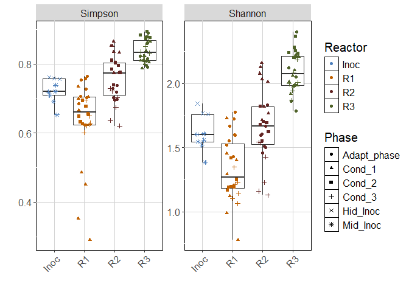
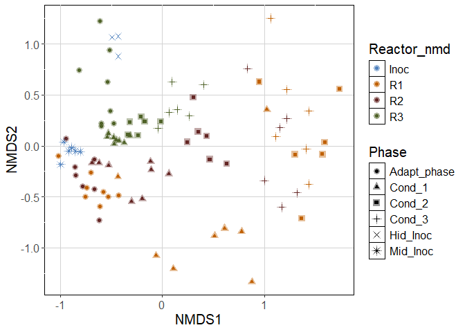
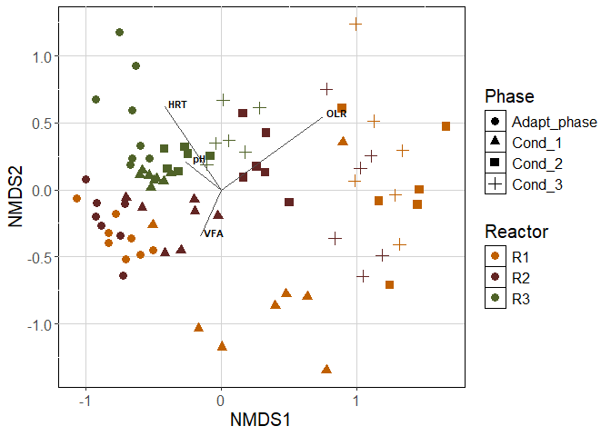

Phyloseq_mcrA
================
2026-04

# Loading libraries. If needed, use BiocManager to install them

    ## Package: phyloseq
    ## Version: 1.48.0
    ## 
    ## -- File: C:/Users/maria/AppData/Local/R/win-library/4.4/phyloseq/Meta/package.rds 
    ## -- Fields read: Package, Version

    ## Package: ggplot2
    ## Version: 4.0.0
    ## 
    ## -- File: C:/Users/maria/AppData/Local/R/win-library/4.4/ggplot2/Meta/package.rds 
    ## -- Fields read: Package, Version

    ## Package: vegan
    ## Version: 2.7-1
    ## 
    ## -- File: C:/Users/maria/AppData/Local/R/win-library/4.4/vegan/Meta/package.rds 
    ## -- Fields read: Package, Version

    ## Package: readr
    ## Version: 2.2.0
    ## 
    ## -- File: C:/Users/maria/AppData/Local/R/win-library/4.4/readr/Meta/package.rds 
    ## -- Fields read: Package, Version

    ## Package: tidyverse
    ## Version: 2.0.0
    ## 
    ## -- File: C:/Users/maria/AppData/Local/R/win-library/4.4/tidyverse/Meta/package.rds 
    ## -- Fields read: Package, Version

    ## Package: RColorBrewer
    ## Version: 1.1-3
    ## 
    ## -- File: C:/Users/maria/AppData/Local/R/win-library/4.4/RColorBrewer/Meta/package.rds 
    ## -- Fields read: Package, Version

# Importing files and renaming ASVs

``` r
seqtab.nochim <- readr::read_csv("seqtab.nochim.csv")
```

    ## New names:
    ## Rows: 96 Columns: 272
    ## ── Column specification
    ## ──────────────────────────────────────────────────────── Delimiter: "," dbl
    ## (272): ...1, TGCAACCGCTGCATACACTGATGATATCCTCGACAACAACGTGTACTACGACGTTGACT...
    ## ℹ Use `spec()` to retrieve the full column specification for this data. ℹ
    ## Specify the column types or set `show_col_types = FALSE` to quiet this message.
    ## • `` -> `...1`

``` r
seqtab.nochim <- as.data.frame(seqtab.nochim)
rownames(seqtab.nochim) <- seqtab.nochim[, 1]
seqtab.nochim <- seqtab.nochim[, -1]
colnames(seqtab.nochim) = paste0("ASV", 1:ncol(seqtab.nochim)) 

taxa <- read.csv("taxa_all_euk.csv", row.names = 1)
row.names(taxa) = colnames(seqtab.nochim)
taxa <- as.matrix(taxa)

metadata <- read.csv("metadata.csv", stringsAsFactors = TRUE, row.names = 1)
```

# Building phyloseq object

``` r
ps.silva.nochim <- phyloseq(
  otu_table(seqtab.nochim, taxa_are_rows=FALSE),
  sample_data(metadata),
  tax_table(taxa))

ps <- ps.silva.nochim
ps
```

    ## phyloseq-class experiment-level object
    ## otu_table()   OTU Table:         [ 271 taxa and 96 samples ]
    ## sample_data() Sample Data:       [ 96 samples by 11 sample variables ]
    ## tax_table()   Taxonomy Table:    [ 271 taxa by 7 taxonomic ranks ]

# Rarefying

``` r
set.seed(1)

counts <- sample_sums(ps)
sort(counts)
```

    ##    29    80     6    63    57    62    64    41     9    58    65    86    46 
    ##  7154 14665 18586 19303 19792 21010 21088 21210 21334 21374 22014 22434 22643 
    ##    13    74    87     7    73    45    43    48    42    50    40    82    44 
    ## 22864 22887 23138 23173 23200 23272 23482 23505 24075 24221 24274 24505 24526 
    ##    72    88    69     5    79    84    37    70    71    32    14    12    47 
    ## 24751 25032 25110 25182 25183 25260 25598 25611 25896 25982 26040 26321 26561 
    ##     8    77    85    93    81    68    34    67    89    78    33    39    10 
    ## 26637 26766 26865 26919 26972 27184 27603 27943 28047 28684 28767 28805 28820 
    ##    59    31    54    92    96    49    66    76    30    35    15    83    91 
    ## 29001 29117 29675 29760 29889 29943 30221 30380 31394 31398 31430 31835 31898 
    ##    17    38    90    24    27    53    36    75    28     1    16    11    22 
    ## 31991 32110 32279 32620 32704 32988 33184 33200 33420 33561 34064 35562 35735 
    ##    26    20    21    25    94    23    51    18     4    60    61     2    52 
    ## 35893 36196 37331 37418 38168 38376 38634 38728 38804 39208 40187 40212 41146 
    ##    95     3    19    56    55 
    ## 41824 42264 45871 48751 61717

``` r
ps_withoutB29 <- subset_samples(ps, Code != "B29")

ps_withoutB29_rarified <- rarefy_even_depth(ps_withoutB29, sample.size = min(sample_sums(ps_withoutB29)),
                  rngseed = FALSE, replace = FALSE, trimOTUs = TRUE, verbose = TRUE)
```

    ## You set `rngseed` to FALSE. Make sure you've set & recorded
    ##  the random seed of your session for reproducibility.
    ## See `?set.seed`

    ## ...

    ## 10OTUs were removed because they are no longer 
    ## present in any sample after random subsampling

    ## ...

# Samples colected from the foam will not be used in this manuscript, so we exclude them from the analysis

``` r
ps_withoutB29_rarified_withoutFOAM <- subset_samples(ps_withoutB29_rarified, Phase != "R1_Foam")
ps_withoutB29_rarified_withoutFOAM <- subset_samples(ps_withoutB29_rarified_withoutFOAM, Phase != "R2_Foam")
ps_withoutB29_rarified_withoutFOAM <- subset_samples(ps_withoutB29_rarified_withoutFOAM, Phase != "R3_Foam")
ps_withoutB29_rarified_withoutFOAM
```

    ## phyloseq-class experiment-level object
    ## otu_table()   OTU Table:         [ 261 taxa and 92 samples ]
    ## sample_data() Sample Data:       [ 92 samples by 11 sample variables ]
    ## tax_table()   Taxonomy Table:    [ 261 taxa by 7 taxonomic ranks ]

# Alpha-diversity figure

``` r
cols <- c("Inoc" = "#4F81BD", "R1" = "#C06000", "R2" = "#632523", "R3" = "#4F6228")
cols2 <- c("Mid_Inoc" = "#4F81BD", "Hid_Inoc" = "#4F81BD", "R1" = "#C06000", "R2" = "#632523", "R3" = "#4F6228")

adiv <- data.frame(
  "Shannon" = phyloseq::estimate_richness(ps_withoutB29_rarified_withoutFOAM, measures = "Shannon"),
  "Simpson" = phyloseq::estimate_richness(ps_withoutB29_rarified_withoutFOAM, measures = "Simpson"),
  "Phase" = phyloseq::sample_data(ps_withoutB29_rarified_withoutFOAM)$Phase,
  "Reactor" = phyloseq::sample_data(ps_withoutB29_rarified_withoutFOAM)$Reactor_nmd)
head(adiv)
```

    ##      Shannon   Simpson       Phase Reactor
    ## 1  1.5211499 0.6852765 Adapt_phase      R1
    ## 10 1.7289418 0.7348325      Cond_1      R1
    ## 11 1.2079310 0.4512903      Cond_1      R1
    ## 12 0.7811807 0.2907825      Cond_1      R1
    ## 13 1.1198774 0.4861367      Cond_1      R1
    ## 14 1.4543838 0.6990867      Cond_1      R1

``` r
#png("figures_article/alpha_treatment.png", width = 7, height = 4, units = "in", res=300)
adiv %>%
  gather(key = metric, value = value, c("Simpson", "Shannon")) %>%
  mutate(metric = factor(metric, levels = c("Simpson", "Shannon"))) %>%
  ggplot(aes(x = Reactor, y = value)) +
  geom_boxplot(outlier.color = NA) +
  scale_colour_manual(values = cols) +
  scale_shape_manual(values= c(16, 17, 15, 3, 4, 8)) +
  geom_jitter(aes(color = Reactor, shape = Phase), height = 0, width = .2) +
  labs(x = "", y = "") +
  facet_wrap(~ metric, scales = "free") +
  theme(panel.background = element_rect(fill='white', colour='black'), 
        panel.grid.major = element_line(colour = "lightgrey"), text = element_text(size = 15), 
        axis.text.x = element_text(angle = 45, hjust = 1) )
```

<!-- -->

``` r
#dev.off()
```

# Beta-diversity

``` r
NMDS.bray <- ordinate(ps_withoutB29_rarified_withoutFOAM, "NMDS", "bray")
```

    ## Square root transformation
    ## Wisconsin double standardization
    ## Run 0 stress 0.1473962 
    ## Run 1 stress 0.1929558 
    ## Run 2 stress 0.1473701 
    ## ... New best solution
    ## ... Procrustes: rmse 0.001189243  max resid 0.008608752 
    ## ... Similar to previous best
    ## Run 3 stress 0.192063 
    ## Run 4 stress 0.1625989 
    ## Run 5 stress 0.1490153 
    ## Run 6 stress 0.1473482 
    ## ... New best solution
    ## ... Procrustes: rmse 0.00463229  max resid 0.04307136 
    ## Run 7 stress 0.1912012 
    ## Run 8 stress 0.1473482 
    ## ... New best solution
    ## ... Procrustes: rmse 4.632977e-06  max resid 2.405797e-05 
    ## ... Similar to previous best
    ## Run 9 stress 0.1824503 
    ## Run 10 stress 0.2011042 
    ## Run 11 stress 0.2005947 
    ## Run 12 stress 0.2080341 
    ## Run 13 stress 0.2022447 
    ## Run 14 stress 0.149595 
    ## Run 15 stress 0.1658789 
    ## Run 16 stress 0.1560657 
    ## Run 17 stress 0.1959108 
    ## Run 18 stress 0.2070282 
    ## Run 19 stress 0.2095593 
    ## Run 20 stress 0.1473482 
    ## ... Procrustes: rmse 6.721839e-06  max resid 5.006002e-05 
    ## ... Similar to previous best
    ## *** Best solution repeated 2 times

``` r
NMDS.bray
```

    ## 
    ## Call:
    ## metaMDS(comm = veganifyOTU(physeq), distance = distance) 
    ## 
    ## global Multidimensional Scaling using monoMDS
    ## 
    ## Data:     wisconsin(sqrt(veganifyOTU(physeq))) 
    ## Distance: bray 
    ## 
    ## Dimensions: 2 
    ## Stress:     0.1473482 
    ## Stress type 1, weak ties
    ## Best solution was repeated 2 times in 20 tries
    ## The best solution was from try 8 (random start)
    ## Scaling: centring, PC rotation, halfchange scaling 
    ## Species: expanded scores based on 'wisconsin(sqrt(veganifyOTU(physeq)))'

``` r
plot_NMDS <- plot_ordination(ps_withoutB29_rarified_withoutFOAM, NMDS.bray, type="samples", color="Reactor_nmd", shape = "Phase")
```

    ## Warning: `aes_string()` was deprecated in ggplot2 3.0.0.
    ## ℹ Please use tidy evaluation idioms with `aes()`.
    ## ℹ See also `vignette("ggplot2-in-packages")` for more information.
    ## ℹ The deprecated feature was likely used in the phyloseq package.
    ##   Please report the issue at <https://github.com/joey711/phyloseq/issues>.
    ## This warning is displayed once per session.
    ## Call `lifecycle::last_lifecycle_warnings()` to see where this warning was
    ## generated.

``` r
# plot with all samples 
#png("figures_article/NMDS_bray.png", width = 7, height = 4, units = "in", res=300)
plot_NMDS + 
  scale_colour_manual(values = cols) + 
  geom_point(alpha = 0.4, size = 3) + # Reduce alpha for better visibility of overlays
  scale_shape_manual(values= c(16, 17, 15, 3, 4, 8)) +
  #stat_ellipse(geom = "polygon", alpha = 0.05, level = 0.95, aes(color = Phase), show.legend = TRUE, linetype = 1) +  # Add ellipses
  theme(panel.background = element_rect(fill='white', colour='black'), panel.grid.major = element_line(colour = "lightgrey"), text = element_text(size = 15))
```

<!-- -->

``` r
#dev.off()


# plot without inoculum samples and environmental variables
# following this script: https://jkzorz.github.io/2020/04/04/NMDS-extras.html
ps_withoutB29_rarified_withoutFOAM_withoutINOC <- subset_samples(ps_withoutB29_rarified_withoutFOAM, Reactor_nmd != "Inoc")
ps_withoutB29_rarified_withoutFOAM_withoutINOC_2 <- subset_samples(ps_withoutB29_rarified_withoutFOAM_withoutINOC, Code != "B38") #removing B38 due to lack of env data

NMDS.bray2 <- ordinate(ps_withoutB29_rarified_withoutFOAM_withoutINOC_2, "NMDS", "bray")
```

    ## Square root transformation
    ## Wisconsin double standardization
    ## Run 0 stress 0.1464414 
    ## Run 1 stress 0.187092 
    ## Run 2 stress 0.1464413 
    ## ... New best solution
    ## ... Procrustes: rmse 4.242116e-05  max resid 0.0003425115 
    ## ... Similar to previous best
    ## Run 3 stress 0.1858732 
    ## Run 4 stress 0.1985433 
    ## Run 5 stress 0.1937268 
    ## Run 6 stress 0.1463788 
    ## ... New best solution
    ## ... Procrustes: rmse 0.007695585  max resid 0.06790219 
    ## Run 7 stress 0.2021725 
    ## Run 8 stress 0.2015236 
    ## Run 9 stress 0.1928031 
    ## Run 10 stress 0.1464413 
    ## ... Procrustes: rmse 0.007694008  max resid 0.06798147 
    ## Run 11 stress 0.1589637 
    ## Run 12 stress 0.179923 
    ## Run 13 stress 0.1909213 
    ## Run 14 stress 0.192027 
    ## Run 15 stress 0.1463788 
    ## ... New best solution
    ## ... Procrustes: rmse 4.752439e-06  max resid 2.546268e-05 
    ## ... Similar to previous best
    ## Run 16 stress 0.1752334 
    ## Run 17 stress 0.1463788 
    ## ... Procrustes: rmse 7.137852e-06  max resid 4.50448e-05 
    ## ... Similar to previous best
    ## Run 18 stress 0.1666309 
    ## Run 19 stress 0.1713639 
    ## Run 20 stress 0.1941475 
    ## *** Best solution repeated 2 times

``` r
NMDS.bray2
```

    ## 
    ## Call:
    ## metaMDS(comm = veganifyOTU(physeq), distance = distance) 
    ## 
    ## global Multidimensional Scaling using monoMDS
    ## 
    ## Data:     wisconsin(sqrt(veganifyOTU(physeq))) 
    ## Distance: bray 
    ## 
    ## Dimensions: 2 
    ## Stress:     0.1463788 
    ## Stress type 1, weak ties
    ## Best solution was repeated 2 times in 20 tries
    ## The best solution was from try 15 (random start)
    ## Scaling: centring, PC rotation, halfchange scaling 
    ## Species: expanded scores based on 'wisconsin(sqrt(veganifyOTU(physeq)))'

``` r
metadata_new <- read.csv2("metadata_new_mod.csv", stringsAsFactors = TRUE, row.names = 1)

en <- envfit(NMDS.bray2, metadata_new, permutations = 999, na.rm = TRUE)

data.scores <- as.data.frame(scores(NMDS.bray2)$sites)
data.scores$Phase <- ps_withoutB29_rarified_withoutFOAM_withoutINOC_2@sam_data$Phase
data.scores$Reactor <- ps_withoutB29_rarified_withoutFOAM_withoutINOC_2@sam_data$Reactor_nmd

en_coord_cont = as.data.frame(scores(en, "vectors")) * ordiArrowMul(en)

#png("figures_article/NMDS_bray_with_env.png", width = 7, height = 4, units = "in", res=300)
ggplot(data = data.scores, aes(x = NMDS1, y = NMDS2)) + 
  geom_point(data = data.scores, aes(colour = Reactor, shape = Phase), size = 3) + 
  scale_colour_manual(values = cols) + 
  scale_shape_manual(values= c(16, 17, 15, 3, 4, 8)) +
  geom_segment(aes(x = 0, y = 0, xend = NMDS1, yend = NMDS2), 
               data = en_coord_cont, size =0.5, alpha = 1, colour = "grey30") +
  geom_text(data = en_coord_cont, aes(x = NMDS1+0.1, y = NMDS2+0.03), colour = "black", 
            fontface = "bold", label = row.names(en_coord_cont), size =3) +
  labs(shape="Phase", colour="Reactor") +
  theme(panel.background = element_rect(fill='white', colour='black'), panel.grid.major = element_line(colour = "lightgrey"), text = element_text(size = 15))
```

    ## Warning: Using `size` aesthetic for lines was deprecated in ggplot2 3.4.0.
    ## ℹ Please use `linewidth` instead.
    ## This warning is displayed once per session.
    ## Call `lifecycle::last_lifecycle_warnings()` to see where this warning was
    ## generated.

<!-- -->

``` r
#dev.off()
```

# Taxonomy plot - Genus

``` r
list_days <- c("R1-1", "R1-2", "R1-3", "R2-1", "R2-2", "R2-3", "R3-1", "R3-2", "R3-3", "2", "6", "10", "14", "18", "22", "28", "40", "52", "54", "64", "66", "76", "78", "88", "90", "100", "102", "112", "114", "124", "126", "136", "138", "144", "146", "152", "154", "160", "162", "168", "170", "176", "178", "180", "182", "184", "186", "192", "194", "200", "202", "208", "210", "216", "218", "224", "226")

y1p <- tax_glom(ps_withoutB29_rarified_withoutFOAM_withoutINOC, taxrank = 'Genus') # agglomerate taxa
y3p <- transform_sample_counts(y1p, function(x) x/sum(x)) #get abundance in %
y4p <- psmelt(y3p) # create dataframe from phyloseq object
y4p$Genus <- as.character(y4p$Genus) #convert to character
y4p$Genus[y4p$Abundance < 0.05] <- " Genus < 5% abund." #rename genera with < 1% abundance

#set color palette to accommodate the number of genera
colourCount = length(unique(y4p$Genus))
getPalette <- colorRampPalette(brewer.pal(9, "Set1"))

#plot
y4p$Days_operation = factor(y4p$Days_operation, levels= list_days)

# all samples
#png("figures_article/Tax_Genus_days.png", width = 10, height = 4, units = "in", res=300)
p_p <- ggplot(data=y4p, aes(x=Days_operation, y=Abundance, fill=Genus))
p_p + geom_bar(aes(), stat="identity", position="stack") + 
  facet_wrap(~ Reactor_tax, 
             #nrow = 3, 
             scales = "free", labeller = labeller(.multi_line = FALSE)) +
  scale_fill_manual(values=getPalette(colourCount)) + 
  xlab("Days of operation") + ylab("Relative Abundance") +
  #  guides(fill=guide_legend(nrow=5)) +
  theme(axis.text.x = element_text(angle=90, size= 8), axis.title.x = element_text(vjust=0),
        text = element_text(size = 10), legend.position = "bottom")
```

<!-- -->

``` r
#dev.off()
```

``` r
sessionInfo()
```

    ## R version 4.4.1 (2024-06-14 ucrt)
    ## Platform: x86_64-w64-mingw32/x64
    ## Running under: Windows 11 x64 (build 26200)
    ## 
    ## Matrix products: default
    ## 
    ## 
    ## locale:
    ## [1] LC_COLLATE=English_Germany.utf8  LC_CTYPE=English_Germany.utf8   
    ## [3] LC_MONETARY=English_Germany.utf8 LC_NUMERIC=C                    
    ## [5] LC_TIME=English_Germany.utf8    
    ## 
    ## time zone: Europe/Berlin
    ## tzcode source: internal
    ## 
    ## attached base packages:
    ## [1] stats     graphics  grDevices utils     datasets  methods   base     
    ## 
    ## other attached packages:
    ##  [1] RColorBrewer_1.1-3 lubridate_1.9.5    forcats_1.0.1      stringr_1.6.0     
    ##  [5] dplyr_1.1.4        purrr_1.2.2        tidyr_1.3.2        tibble_3.3.0      
    ##  [9] tidyverse_2.0.0    readr_2.2.0        vegan_2.7-1        permute_0.9-8     
    ## [13] ggplot2_4.0.0      phyloseq_1.48.0   
    ## 
    ## loaded via a namespace (and not attached):
    ##  [1] ade4_1.7-23             tidyselect_1.2.1        farver_2.1.2           
    ##  [4] Biostrings_2.72.1       S7_0.2.0                fastmap_1.2.0          
    ##  [7] digest_0.6.37           timechange_0.4.0        lifecycle_1.0.5        
    ## [10] cluster_2.1.6           survival_3.6-4          magrittr_2.0.4         
    ## [13] compiler_4.4.1          rlang_1.1.6             tools_4.4.1            
    ## [16] igraph_2.1.4            yaml_2.3.12             data.table_1.17.8      
    ## [19] knitr_1.51              labeling_0.4.3          bit_4.6.0              
    ## [22] plyr_1.8.9              withr_3.0.2             BiocGenerics_0.50.0    
    ## [25] grid_4.4.1              stats4_4.4.1            multtest_2.60.0        
    ## [28] biomformat_1.32.0       colorspace_2.1-1        Rhdf5lib_1.26.0        
    ## [31] scales_1.4.0            iterators_1.0.14        MASS_7.3-60.2          
    ## [34] dichromat_2.0-0.1       cli_3.6.5               rmarkdown_2.31         
    ## [37] crayon_1.5.3            generics_0.1.4          rstudioapi_0.18.0      
    ## [40] httr_1.4.8              reshape2_1.4.4          tzdb_0.5.0             
    ## [43] ape_5.8-1               rhdf5_2.48.0            zlibbioc_1.50.0        
    ## [46] splines_4.4.1           parallel_4.4.1          XVector_0.44.0         
    ## [49] vctrs_0.6.5             Matrix_1.7-0            jsonlite_2.0.0         
    ## [52] IRanges_2.38.1          hms_1.1.4               S4Vectors_0.42.1       
    ## [55] bit64_4.8.0             foreach_1.5.2           glue_1.8.0             
    ## [58] codetools_0.2-20        stringi_1.8.7           gtable_0.3.6           
    ## [61] GenomeInfoDb_1.40.1     UCSC.utils_1.0.0        pillar_1.11.1          
    ## [64] htmltools_0.5.9         rhdf5filters_1.16.0     GenomeInfoDbData_1.2.12
    ## [67] R6_2.6.1                vroom_1.7.1             evaluate_1.0.5         
    ## [70] lattice_0.22-6          Biobase_2.64.0          Rcpp_1.1.0             
    ## [73] nlme_3.1-164            mgcv_1.9-1              xfun_0.57              
    ## [76] pkgconfig_2.0.3
